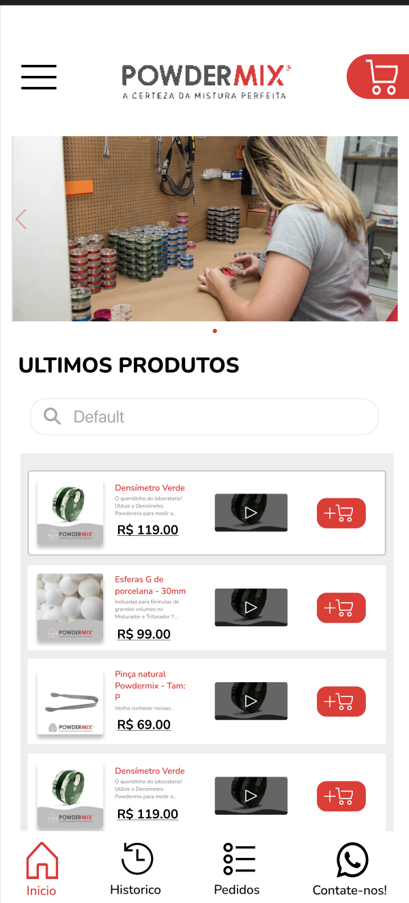

# Powdermix App

**Powdermix App** é um aplicativo desenvolvido para facilitar a venda de maquinário farmacêutico, como equipamentos utilizados por farmácias na fabricação de medicamentos. O aplicativo conta com funcionalidades como carrinho de compras, histórico de pedidos e gerenciamento de compras, tudo integrado em uma interface simples e eficiente.



---

## 🎯 **Funcionalidades Principais**
- 📋 **Catálogo de Produtos**: Visualize e navegue por uma lista completa de equipamentos farmacêuticos disponíveis para compra.
- 🛒 **Carrinho de Compras**: Adicione produtos ao carrinho e conclua pedidos diretamente no aplicativo.
- 🔄 **Histórico de Pedidos**: Acompanhe os pedidos realizados de forma prática e organizada.
- 🔍 **Sincronização de Produtos**: As informações dos produtos são sincronizadas diretamente do **Google Sheets**, garantindo praticidade para o cliente.

---

## 🚀 **Tecnologias Utilizadas**
- **Frontend**:
  - [React Native](https://reactnative.dev/) + [Expo](https://expo.dev/): Para o desenvolvimento do aplicativo mobile.
- **Backend**:
  - [Node.js](https://nodejs.org/) + [TypeScript](https://www.typescriptlang.org/): Para a criação da API que gerencia os dados e funcionalidades do aplicativo.
- **Integrações**:
  - **Google Sheets API**: Utilizado para sincronizar as informações dos produtos, já que o cliente preferiu não utilizar um banco de dados tradicional.

---

## 📱 **Publicação**
O aplicativo foi lançado oficialmente na **Google Play Store**, permitindo que os clientes da Powdermix realizem compras diretamente pelo celular.

---

## 🌟 **Destaques**
- Interface otimizada para uma experiência fluida do usuário.
- Sem necessidade de banco de dados tradicional, com sincronização direta por **Google Sheets**.
- Funcionalidades completas de e-commerce, adaptadas ao segmento de maquinário farmacêutico.

---

## 🛠️ **Como Executar o Projeto Localmente**
### Pré-requisitos:
- **Node.js** instalado.
- Gerenciador de pacotes **npm** ou **yarn**.
- **Expo CLI** instalado globalmente:  
  ```bash
  npm install -g expo-cli
